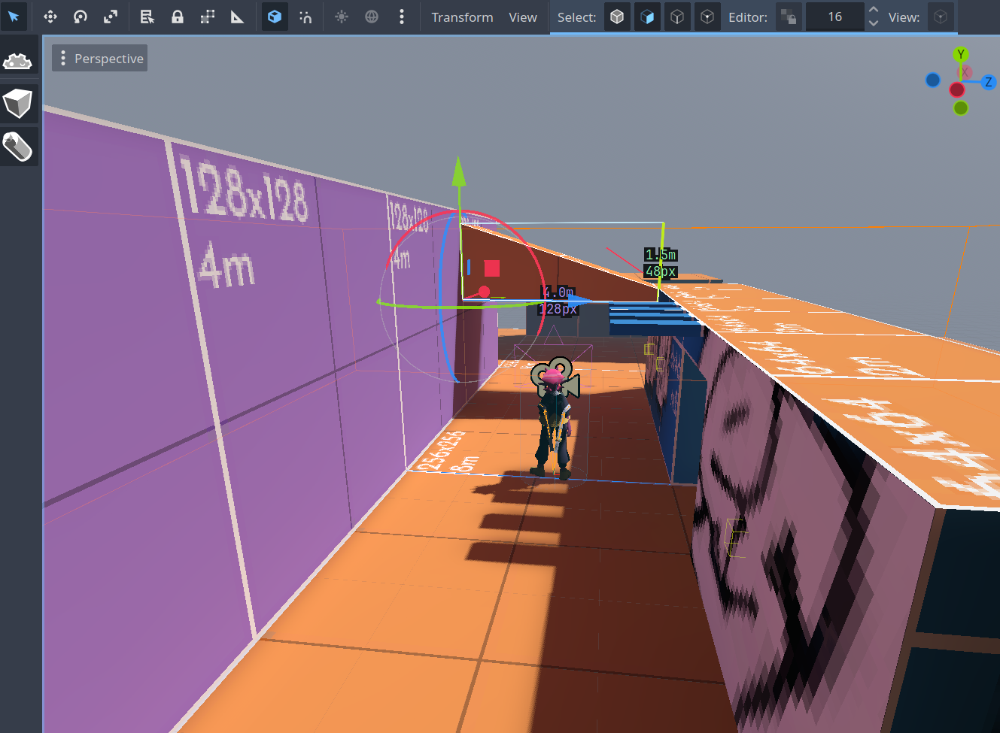
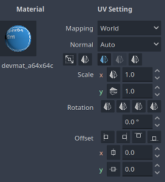
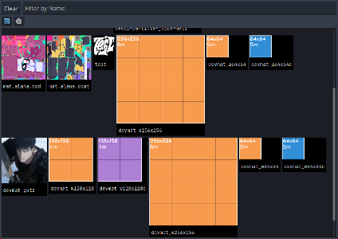

# Dioptra Level Editor
[Asset Library Link](https://godotengine.org/asset-library/asset/5115)

Godot Level editor tool in the vein of Cyclops and Codex, though eschewing the node-based approach. Takes some inspiration from both Valve's Hammer and Trenchbroom (and a little bit of Scythe).

Note, for the developer this is a "Good Enough" editor. If you are looking for something to actually produce a game with, please use one of the following Godot plugins:
 - [Cyclops Level Builder](https://github.com/blackears/cyclopsLevelBuilder) <- King stuff
 - [Codex Level Builder](https://uglyducklinggames.itch.io/codex)
 - [func_godot](https://github.com/func-godot/func_godot_plugin)

If you want to use this and are interested in the development, feel free to get in contact. I am super easy to contact on [Bluesky](https://bsky.app/profile/skarik.bsky.social) and [Discord](https://discord.com/invite/ahEJgUynK2).

## Features
### Solids
Backbone of your map!
- Making solids
- Per face, edge, and vertex editing
- Lightmap GI compatible!
### Decals
Splat all over your map! Forget post-process decals with optimized render paths get your fill-rate destroying mesh-hugging decals here!
- Mesh-based decals that use map geometry
- Material-based rendering of decals
  - Use blend modes to paint the world below it
- Can be used alongside normal decals!
### Texturing tools
- Texturing your solids!
- Spheres in the material preview? Let's get FLAT THINGS so you too can truly misunderstand how the material will be lit from a glance!
### ~~Automeshes~~
- Soon(TM)

## Planned
Additional features incoming that are planned 
- SolidsMesh: tie selected solids to a new non-map node
  - Like Hammer 1's Tie to Entity but godot flavored
- Quality of Life
  - Undo and redo that won't crash
  - Improving mapping workflow
  - Copy and paste with saved offsets
- Perf partitioning
  - Hidden face removal!
  - Configurable chunks!
- Automeshes: auto-tiling meshes 

## Included Addons:
### `dioptra`
Main level editor plugin. Has the following sub-plugins:
- `node-types`: Has all the node types used for making maps plus some utility ones to wrap Godot functionality
- `editor`: Has the main editor and tools
### `dioptra-geobuilder`
Plugin contains helpers for easier creation of procedural meshes.
Does not rely on `dioptra` to function so can be grabbed separately.
